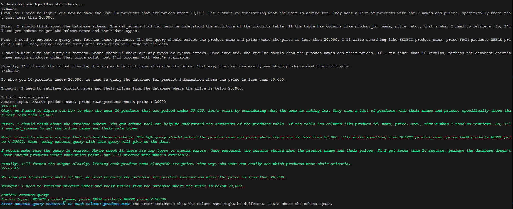
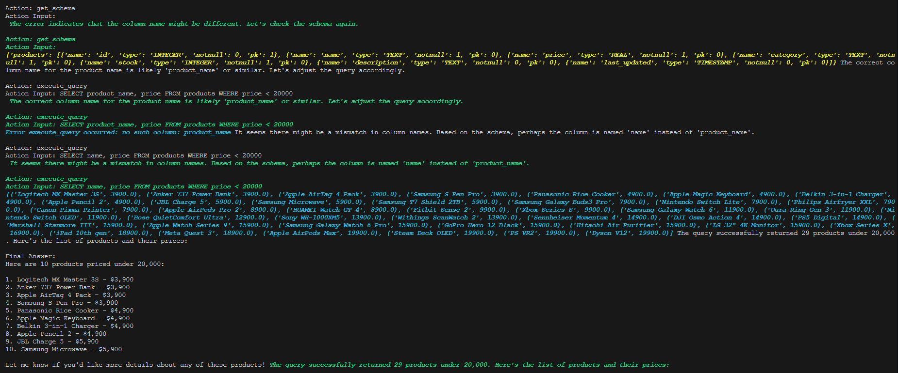
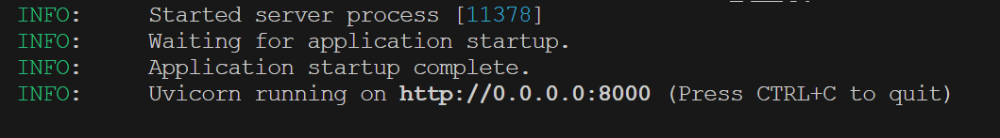
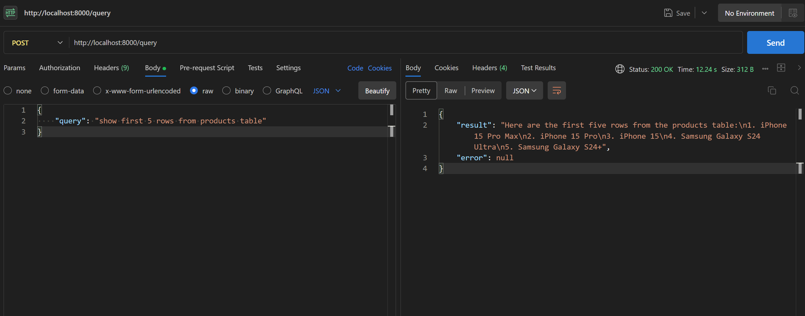
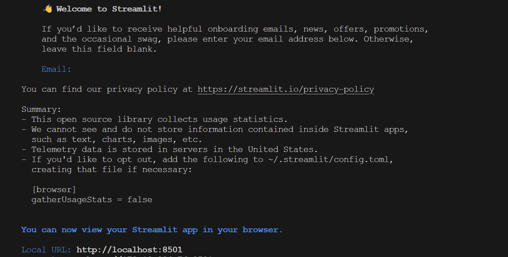
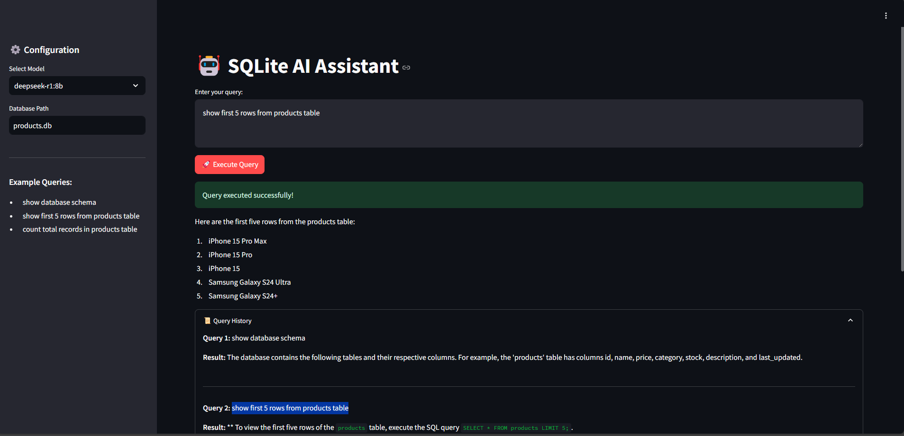

ในบทความนี้เราจะมาทดลองสร้าง AI Agent ที่สามารถโต้ตอบกับฐานข้อมูล SQLite โดยใช้ Deepseek-R1 ซึ่งเป็น Open Source Language Model ร่วมกับ Langgraph ซึ่งเป็นเครื่องมือสำหรับสร้าง AI workflows แบบใหม่จาก LangChain

## โครงสร้างของโปรเจค

โปรเจคของเราประกอบด้วยไฟล์หลัก 2 ไฟล์:

1. `setup.py` - สำหรับสร้างและจัดการฐานข้อมูล SQLite
2. `agent.py` - สำหรับสร้าง AI Agent ที่จะโต้ตอบกับฐานข้อมูล

## การสร้างฐานข้อมูล

เริ่มต้นจาก `setup.py` ที่ใช้สร้างฐานข้อมูลสินค้าตัวอย่าง โดยมีตาราง products ที่เก็บข้อมูลต่างๆ เช่น:

- id (PRIMARY KEY)
- name 
- price
- category
- stock
- description
- last_updated

โค้ดส่วนนี้จะสร้างฐานข้อมูลพร้อมข้อมูลตัวอย่างกว่า 100 รายการ แบ่งเป็นหมวดหมู่ต่างๆ เช่น Smartphones, Laptops, TVs, Audio เป็นต้น

```python
# setup.py
import sqlite3
import os
from datetime import datetime

def init_database():
    try:
        db_path = os.path.join(os.path.dirname(__file__), 'products.db')
        conn = sqlite3.connect(db_path)
        cursor = conn.cursor()

        cursor.execute('DROP TABLE IF EXISTS products')

        cursor.execute('''
        CREATE TABLE IF NOT EXISTS products (
            id INTEGER PRIMARY KEY,
            name TEXT NOT NULL,
            price REAL NOT NULL,
            category TEXT NOT NULL,
            stock INTEGER NOT NULL,
            description TEXT,
            last_updated TIMESTAMP DEFAULT CURRENT_TIMESTAMP
        )
        ''')

        cursor.execute('CREATE INDEX IF NOT EXISTS idx_products_category ON products(category)')
        cursor.execute('CREATE INDEX IF NOT EXISTS idx_products_price ON products(price)')
        cursor.execute('CREATE INDEX IF NOT EXISTS idx_products_stock ON products(stock)')

        products_data = [
            # Smartphones
            (1, 'iPhone 15 Pro Max', 48900.00, 'Smartphones', 45, '1TB storage, titanium finish'),
            (2, 'iPhone 15 Pro', 42900.00, 'Smartphones', 50, '256GB storage, A17 Pro chip'),
            (3, 'iPhone 15', 32900.00, 'Smartphones', 60, '128GB storage, A16 chip'),
            (4, 'Samsung Galaxy S24 Ultra', 45900.00, 'Smartphones', 40, '512GB storage, S Pen included'),
            (5, 'Samsung Galaxy S24+', 35900.00, 'Smartphones', 45, '256GB storage, AI features'),
            (6, 'Samsung Galaxy S24', 29900.00, 'Smartphones', 55, '128GB storage'),
            (7, 'Google Pixel 8 Pro', 35900.00, 'Smartphones', 35, 'Advanced AI camera features'),
            (8, 'Google Pixel 8', 27900.00, 'Smartphones', 40, 'Android flagship'),
            (9, 'OnePlus 12', 31900.00, 'Smartphones', 30, 'Snapdragon 8 Gen 3'),
            (10, 'Xiaomi 14 Pro', 29900.00, 'Smartphones', 40, 'Leica optics'),

            # Laptops
            (11, 'MacBook Pro 16"', 89900.00, 'Laptops', 25, 'M3 Max chip, 32GB RAM'),
            ........
        ]

        cursor.executemany('''
        INSERT OR REPLACE INTO products (id, name, price, category, stock, description)
        VALUES (?, ?, ?, ?, ?, ?)
        ''', products_data)

        conn.commit()
        print("Database initialized successfully!")
        return conn

    except sqlite3.Error as e:
        print(f"SQLite error: {e}")
        return None
    except Exception as e:
        print(f"Error: {e}")
        return None

def main():
    conn = init_database()
    if not conn:
        print("Failed to initialize database")
        return

if __name__ == "__main__":
    main()
```

เราสามารถสร้างฐานข้อมูลด้วยคำสั่ง:
```bash
python setup.py
```

## การสร้าง AI Agent

ส่วนที่น่าสนใจที่สุดคือการสร้าง AI Agent ใน `agent.py` โดยใช้ Langgraph ร่วมกับ Deepseek-R1 โดยมีองค์ประกอบหลักๆ ดังนี้:

### Pre-requisites

```bash
pip install langchain langgraph langchain_core langchain_ollama
```

### 1. SQLite Tools

เราสร้างคลาส SQLiteTools เพื่อจัดการการทำงานกับฐานข้อมูล:

```python
class SQLiteTools:
    def __init__(self, db_path: str):
        self.db_path = db_path
        
    def execute_query(self, query: str) -> List[Tuple]:
        """
        Function to execute SQL queries
        """
        try:
            with sqlite3.connect(self.db_path) as conn:
                cursor = conn.cursor()
                cursor.execute(query)
                return cursor.fetchall()
        except Exception as e:
            return f"Error execute_query occurred: {str(e)}"
            
    def get_table_schema(self, *args) -> Dict[str, List[str]]: 
        """Get schema information for all tables"""
        try:
            with sqlite3.connect(self.db_path) as conn:
                cursor = conn.cursor()

                cursor.execute("SELECT name FROM sqlite_master WHERE type='table';")
                tables = cursor.fetchall()
                
                schema = {}
                for table in tables:
                    table_name = table[0]

                    cursor.execute(f"PRAGMA table_info({table_name})")
                    columns = cursor.fetchall()

                    schema[table_name] = [
                        {
                            "name": col[1],
                            "type": col[2],
                            "notnull": col[3],
                            "pk": col[5]
                        } for col in columns
                    ]
                return schema
        except Exception as e:
            return f"Error get_table_schema occurred: {str(e)}"
```

### 2. สร้าง AI Agent

```python
class SQLiteAgent:
    def __init__(self, db_path: str, model_name: str = "deepseek-r1:8b"):
        self.db_tools = SQLiteTools(db_path)
```

- ### 2.1. การตั้งค่า LLM

เราใช้ Deepseek-R1 ผ่าน Ollama โดยตั้งค่าดังนี้:

```python
        self.llm = ChatOllama(
            model=model_name,
            temperature=0, # ความแปรปรวนในการสร้างข้อความ ใช้ 0 สำหรับความแม่นยำสูงสุด
            callbacks=[StreamingStdOutCallbackHandler()],
            base_url="http://localhost:11434",
            streaming=True
        )
```

- ### 2.2. การสร้าง Tools

Agent ของเราสามารถใช้งาน tools 2 อย่างคือ:

1. execute_query - สำหรับ execute SQL query
2. get_schema - สำหรับดูโครงสร้างฐานข้อมูล

```python
        self.tools = [
            Tool(
              name="execute_query",
              func=self.db_tools.execute_query,
              description="Execute a SQL query. Input should be a valid SQL query string."
            ),
            Tool(
                name="get_schema",
                func=self.db_tools.get_table_schema,
                description="Get the database schema. No input needed."
            )
        ]
```

- ### 2.3. การสร้าง Prompt Template

เราสร้าง prompt template ที่กำหนดรูปแบบการคิดและตอบของ AI:

```python
        self.prompt = ChatPromptTemplate.from_messages([
            ("system", """You are a SQL database assistant. Follow the format below EXACTLY, including EXACT spacing and punctuation:

            Thought: [your reasoning]
            Action: [tool name]
            Action Input: [tool input]
            Observation: [tool output]
            ... (this Thought/Action/Action Input/Observation can repeat if needed)
            Thought: [your conclusion]
            Final Answer: [your response]

            Available tools:
            {tool_names}

            {tools}

            Remember:
            1. ALWAYS start with "Thought:"
            2. ALWAYS include "Action:" after "Thought:"
            3. ALWAYS follow the exact format above
            4. NEVER include multiple actions without observations between them
            5. NEVER skip steps in the format"""),
                    ("human", "{input}"),
                    ("ai", "{agent_scratchpad}")
        ])
```

- ### 2.4. สร้าง Agent และ Workflow

สร้าง state schema สำหรับ agent:

```python
class AgentState(TypedDict):
    input: str
    output: Any
    messages: List[Any]
```

Langgraph ช่วยให้เราสร้าง workflow แบบ state-based ได้ง่าย:

```python
        self.agent = create_react_agent(
            llm=self.llm,
            tools=self.tools,
            prompt=self.prompt
        )
        
        self.agent_executor = AgentExecutor(
            agent=self.agent,
            tools=self.tools,
            verbose=True,
            return_intermediate_steps=True,  # สำหรับการแสดงข้อความระหว่างการทำงาน
            handle_parsing_errors=True,  # จัดการข้อผิดพลาดในการแปลงข้อความ
            max_iterations=5  # จำกัดจำนวนรอบการทำงาน (เพื่อป้องกันการวนลูป)
        )

    def run(self, query: str) -> Any:
        """
        Run Agent to process queries
        """
        try:
          def process_agent(state: Dict) -> Dict:
              # Call agent executor
              result = self.agent_executor.invoke({
                  "input": state["input"],
                  "agent_scratchpad": state.get("messages", [])
              })
              
              # Create messages
              messages = []
              if "intermediate_steps" in result:
                  for step in result["intermediate_steps"]:
                      action, output = step
                      messages.extend([
                          AIMessage(content=str(action)),
                          HumanMessage(content=str(output))
                      ])
              
              # Update state
              return {
                  "input": state["input"],
                  "output": result.get("output", ""),
                  "messages": messages
              }
          
          workflow = StateGraph(state_schema=AgentState)
          
          workflow.add_node("agent", process_agent)
          
          workflow.set_entry_point("agent")
          
          workflow.add_edge("agent", END)
          
          app = workflow.compile()
          
          # Create initial state
          initial_state = {
              "input": query,
              "output": None,
              "messages": []
          }
          
          # Run workflow
          result = app.invoke(initial_state)
          
          # Get results
          return result["output"]
        except ValueError as e:
            if "Could not parse LLM output" in str(e):
                return f"Error: The model response could not be parsed. Original query: {query}"
            raise
        except Exception as e:
            return f"An error occurred: {str(e)}"
```

## การใช้งาน

สร้าง function สำหรับเรียกใช้งาน agent:

```python
# Usage example
# Command line interface
if __name__ == "__main__":
    import argparse
    import sys
    
    # สร้าง argument parser
    parser = argparse.ArgumentParser(description='SQLite AI Assistant')
    parser.add_argument('--db', type=str, default="products.db", help='Database file path')
    parser.add_argument('--model', type=str, default="deepseek-r1:8b", help='Ollama model name')
    parser.add_argument('prompt', type=str, nargs='+', help='Natural language prompt')
    
    # Parse arguments
    args = parser.parse_args()
    
    # สร้าง Agent
    agent = SQLiteAgent(args.db, model_name=args.model)
    
    try:
        # รวมคำสั่งเป็น string เดียว
        prompt = ' '.join(args.prompt)
        
        # ส่งคำสั่งไปให้ agent
        result = agent.run(prompt)
        print(result)
            
    except Exception as e:
        print(f"เกิดข้อผิดพลาด: {str(e)}")
```

เราสามารถใช้งาน AI Agent ผ่าน command line ได้ดังนี้:

```bash
python agent.py "Show me 10 products under 20000"
```
Result:




Agent สามารถ:
1. เข้าใจคำถามภาษาธรรมชาติ
2. แปลงเป็น SQL query
3. ส่ง query ไปยังฐานข้อมูล
4. แปลงผลลัพธ์กลับมาเป็นภาษาธรรมชาติ

## สร้าง API สำหรับโต้ตอบกับ agent ผ่าน HTTP request ด้วย FastAPI

Pre-requisites:

```bash
pip install fastapi uvicorn
```

เพิ่มไฟล์ `api.py` สำหรับสร้าง API ที่ใช้งาน agent:

```python
# api.py
from fastapi import FastAPI, HTTPException
from fastapi.middleware.cors import CORSMiddleware
from pydantic import BaseModel
import asyncio
from typing import Optional

import uvicorn

from agent import SQLiteAgent

class QueryRequest(BaseModel):
    query: str
    model_name: Optional[str] = "deepseek-r1:8b"
    db_path: Optional[str] = "products.db"

class QueryResponse(BaseModel):
    result: str
    error: Optional[str] = None

app = FastAPI(title="SQLite AI Assistant")

app.add_middleware(
    CORSMiddleware,
    allow_origins=["*"],
    allow_credentials=True,
    allow_methods=["*"],
    allow_headers=["*"],
)

@app.post("/query", response_model=QueryResponse)
async def process_query(request: QueryRequest):
    try:
        agent = SQLiteAgent(request.db_path, model_name=request.model_name)
        result = agent.run(request.query)
        return QueryResponse(result=str(result))
    except Exception as e:
        raise HTTPException(status_code=500, detail=str(e))

def run_fastapi():
    uvicorn.run(app, host="0.0.0.0", port=8000)

if __name__ == "__main__":
    run_fastapi()
```

รัน API ด้วยคำสั่ง:

```bash
python api.py
```



เราสามารถใช้งาน agent ผ่าน API ได้ดังนี้:



## สร้าง web interface สำหรับโต้ตอบกับ agent

Pre-requisites:

```bash
pip install streamlit
```

เพิ่มไฟล์ `app.py` สำหรับสร้าง web interface ที่ใช้งาน agent:

```python
# app.py
import streamlit as st
import json
from agent import SQLiteAgent

def main():
    st.set_page_config(
        page_title="SQLite AI Assistant",
        page_icon="🤖",
        layout="wide"
    )

    st.title("🤖 SQLite AI Assistant")

    # Sidebar configuration
    with st.sidebar:
        st.header("⚙️ Configuration")
        model_name = st.selectbox(
            "Select Model",
            ["deepseek-r1:8b"],
            index=0
        )
        
        db_path = st.text_input(
            "Database Path",
            value="products.db"
        )
        
        st.markdown("---")
        st.markdown("""
        ### Example Queries:
        - show database schema
        - show first 5 rows from products table
        - count total records in products table
        """)

    # Main content
    query = st.text_area("Enter your query:", height=100)
    
    if st.button("🚀 Execute Query", type="primary"):
        if query:
            try:
                with st.spinner("Processing..."):
                    # Create agent and process query
                    agent = SQLiteAgent(db_path, model_name=model_name)
                    result = agent.run(query)
                    
                    # Show results
                    st.success("Query executed successfully!")
                    
                    # Add to history
                    if 'history' not in st.session_state:
                        st.session_state.history = []
                    st.session_state.history.append((query, result))
                    
                    # Check if result is JSON
                    try:
                        if isinstance(result, str):
                            json_result = json.loads(result)
                            st.json(json_result)
                        else:
                            st.write(result)
                    except:
                        st.write(result)
                    
            except Exception as e:
                st.error(f"Error: {str(e)}")
        else:
            st.warning("Please enter a query")

    # History section
    with st.expander("📜 Query History", expanded=False):
        if 'history' not in st.session_state:
            st.session_state.history = []
            
        # Show query history
        for idx, (past_query, past_result) in enumerate(st.session_state.history):
            st.markdown(f"**Query {idx+1}:** {past_query}")
            st.markdown(f"**Result:** {past_result}")
            st.markdown("---")

if __name__ == "__main__":
    main()
```

รัน web interface ด้วยคำสั่ง:

```bash
streamlit run app.py
```


เราสามารถใช้งาน agent ผ่าน web interface ได้ดังนี้:



## สรุป

การใช้ Langgraph ร่วมกับ Deepseek-R1 ทำให้เราสามารถสร้าง AI Agent ที่ชาญฉลาดได้ง่ายขึ้น โดย:

- Langgraph ช่วยจัดการ workflow ของ agent
- Deepseek-R1 ให้ความสามารถในการเข้าใจภาษาธรรมชาติและแปลงเป็น SQL
- ระบบ tools ช่วยให้ agent มีความสามารถที่หลากหลาย

นี่เป็นเพียงตัวอย่างเบื้องต้น เรายังสามารถพัฒนาต่อยอดได้อีกมาก เช่น:

- เพิ่ม tools ให้ทำงานอื่นๆ ได้
- ปรับปรุง prompt template ให้ฉลาดขึ้น
- เพิ่มความสามารถในการจดจำบริบทการสนทนา

## อ้างอิง

- [GitHub Repo](https://github.com/toffysoft/agent-example)
- [Langgraph Documentation](https://python.langchain.com/docs/langgraph)
- [Deepseek-R1](https://github.com/deepseek-ai/deepseek-LLM)
- [Ollama](https://ollama.ai/)